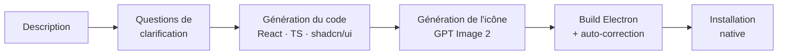

<div align="center">


# La Fabrik

**Créateur d'applications Mac & Windows par IA**

Décris l'app que tu veux. La Fabrik génère le code, dessine l'icône,
build un vrai exécutable natif et l'installe sur ta machine.


</div>

---

## 📥 Téléchargement

Dernières versions stables pour **Windows** et **macOS** :

➡️ <https://github.com/HydrowZer/lafabrik-releases/releases/latest>

À chaque release, ce repo contient :

- `*.dmg` — installateur macOS (universel x86_64 + aarch64)
- `*.app.tar.gz` + `*.sig` — bundle consommé par l'updater Tauri (macOS)
- `*.msi` — installateur Windows MSI
- `*.exe` — installateur Windows NSIS
- `*.nsis.zip` + `*.sig` — bundle consommé par l'updater Tauri (Windows)
- `latest.json` — manifest d'auto-update servi via `releases/latest/download/latest.json`

À partir de la v0.2.0, La Fabrik se met à jour automatiquement
(toast au démarrage + bouton manuel dans **Réglages → À propos**).

> **macOS** : au premier lancement, clic-droit sur l'icône → **Ouvrir** →
> confirmer. L'app est signée Tauri mais pas notarized Apple.

> **Code source** : <https://github.com/HydrowZer/Hydrowapp>

---

## ✨ Le principe

La Fabrik est une application de bureau (Tauri) qui transforme une **description
en langage naturel** en une **vraie application native** — pas une maquette, pas
un mockup figé : un exécutable Electron fonctionnel, installé et prêt à lancer.

> _« Un minuteur Pomodoro avec une icône dans la barre de menu »_
> → une app installée deux minutes plus tard.

## 🔄 Comment ça marche



1. **Tu décris** l'app en une phrase.
2. **L'IA pose des questions** de clarification (choix multiples, dans ta langue) — streamées en direct.
3. **Génération du code** : une app React 19 + TypeScript + Tailwind + shadcn/ui, dans un renderer Electron isolé.
4. **Génération de l'icône** (et du glyphe de barre de menu si l'app en a besoin) via GPT Image 2.
5. **Build natif** via Electron Builder, avec une **boucle d'auto-correction** : si le build casse, l'erreur repart vers l'IA qui corrige le code — jusqu'à deux tentatives.
6. **Installation** dans `/Applications` (macOS) ou l'emplacement équivalent (Windows).

Et après coup, quatre voies pour faire évoluer / diffuser une app installée :

- **Modifier en langage naturel** — une phrase, l'IA applique le changement, rebuild, réinstalle.
- **Studio** (édition visuelle) — preview live de l'app embarquée dans La Fabrik, panneau IA à droite, sélection au clic dans la preview, drag & drop pour réordonner. À la validation : rebuild + réinstall en une fois.
- **Régénérer l'icône** — nouveau prompt → GPT Image 2 → rebuild + réinstall, sans toucher au code.
- **Publier sur le store** — partage l'app avec d'autres utilisateurs de La Fabrik. Un cycle complet : publier v1.0.0, modifier, publier v1.0.1 → ceux qui l'ont installée voient un badge « MAJ disponible ».

## 🧠 Moteurs IA — au choix

| Moteur | Ce qu'il utilise | Idéal si… |
| --- | --- | --- |
| **Claude Code CLI** | Ta session OAuth (abonnement Max / Pro) | tu as déjà Claude Code installé |
| **Codex CLI** | Ton abonnement ChatGPT / Codex | tu as déjà Codex installé |
| **Clé API** | API Anthropic (Claude) ou OpenAI (GPT) | tu préfères payer à l'usage |

Dans tous les cas, les icônes sont générées via **GPT Image 2** — par le proxy IA
intégré s'il est configuré, sinon avec ta propre clé OpenAI.

## 🤖 IA dans les apps générées

Les apps générées peuvent embarquer de l'IA OpenAI via le pont `window.lafabrik.ai` :

- **Texte** — `chat` / `stream` (gpt-5.5), avec vision (images en entrée)
- **Images** — `image` (gpt-image-2)
- **Audio** — `transcribe` (audio → texte) et `tts` (texte → audio)
- **Voix temps réel** — `connectRealtime` : conversation vocale continue en WebRTC
  (gpt-realtime-2, transcription gpt-realtime-whisper)
- **Échappatoire** — `openai(path, body)` pour tout endpoint OpenAI autorisé

La clé API ne vit **jamais** dans une app livrée : elle reste côté serveur sur un
**proxy partagé** (Vercel Edge Function — dossier `ai-proxy/`). Chaque app, et
La Fabrik elle-même pour ses icônes, porte un token HMAC signé minté au build.
Sans proxy configuré, `window.lafabrik.ai` se désactive proprement et les icônes
retombent sur la clé OpenAI de l'utilisateur.

Déploiement du proxy : voir [`ai-proxy/README.md`](https://github.com/HydrowZer/Hydrowapp/blob/main/ai-proxy/README.md).

## 🎯 Fonctionnalités

- **Brainstorm IA** en amont : décris une intention vague, l'IA propose des idées d'apps, puis des mockups visuels avant que tu ne choisisses
- Phase de clarification streamée, avant toute génération
- **Catalogue d'APIs gratuites** : l'IA propose et câble automatiquement les APIs externes pertinentes (météo, news, etc.) ; saisie des clés sur un écran dédié
- Trois moteurs IA interchangeables (CLI ou clé API)
- **Erreurs IA classifiées** — limite atteinte, auth expirée, CLI obsolète, réseau injoignable, clé API invalide : chaque cas affiche un toast actionnable au lieu du dump brut
- Boucle d'auto-correction du build — l'app livrée compile, typecheck TypeScript inclus
- Génération d'icône d'app **et** de glyphe de barre de menu
- Dimensions de fenêtre choisies par l'IA selon le type d'app
- Historique des apps : ouvrir · modifier · **Studio (édition visuelle)** · **régénérer l'icône** · exporter · **publier sur le store** · désinstaller
- **Store hébergé** — catalogue navigable, publication avec auth GitHub, détection de mises à jour avec bouton « Mettre à jour », modération (voir [§ Store](#-store))
- Interface bilingue (français / anglais)
- Apps générées avec le catalogue **shadcn/ui complet** (46 composants) pré-installé
- Apps générées **capables d'IA** — texte, vision, images, audio, voix temps réel

## 💡 Brainstorm — quand tu ne sais pas quoi créer

Si tu as une intention floue plutôt qu'une idée précise (« quelque chose pour
gérer mes lectures », « un outil pour ma routine du matin »), entre par le
**Brainstorm** : l'IA propose plusieurs concepts d'apps, puis génère des
**mockups visuels** (PNG via GPT Image 2) pour les variantes que tu veux
approfondir. Tu en choisis un — la création reprend ensuite le flow normal de
clarification, mais avec ce mockup et le contexte du chat comme référence
visuelle pour la génération.

## 🎨 Studio — édition visuelle d'une app existante

Le Studio ouvre l'app installée dans une **preview embarquée live** (Vite dev en
sidecar, HMR natif) à l'intérieur de La Fabrik, avec un **panneau IA à droite**
pour dicter des modifications en langage naturel.

**Sélection au clic** — bascule en mode « Sélection », clique sur n'importe quel
élément de la preview. Le panneau IA reçoit le contexte du composant (fichier,
ligne, snippet ±10 lignes) — la modification suivante cible précisément cet
élément. Implémenté via un plugin Babel custom injecté en preview qui pose un
`data-lafabrik-source` sur chaque JSX, indépendant des internes React (qui
changent entre versions majeures).

**Drag & drop de fratries** — en mode sélection, drag un élément sur un de ses
frères (même parent DOM) pour les réordonner. Le swap est délégué à l'IA via
un prompt contextuel — plus robuste qu'une manipulation AST côté JS.

**Validation finale** — bouton « Terminer » : un seul rebuild + réinstall
applique toutes les modifs accumulées pendant la session.

## 🖼️ Régénérer l'icône d'une app

Le bouton ✨ sur chaque carte d'app ouvre un dialog avec l'icône actuelle et
le prompt d'origine pré-rempli. Ajuste, clique « Régénérer » : GPT Image 2
dessine une nouvelle icône, l'app est rebuild + réinstallée avec, sans toucher
au code.

## 🏪 Store

La Fabrik embarque un **store hébergé** : tu peux publier les apps que tu as
générées et installer celles publiées par d'autres utilisateurs. Architecture
détaillée dans [`docs/STORE.md`](https://github.com/HydrowZer/Hydrowapp/blob/main/docs/STORE.md).

**Principe — sources, pas binaires.** Le store distribue le code source
(quelques Ko à quelques centaines de Ko en JSON) ; chaque utilisateur **rebuild
en local** via le pipeline existant. Cross-platform gratuit, coûts d'hébergement
faibles, zéro crédit IA consommé au téléchargement (icônes et code sont déjà
dans le manifeste).

**Sécurité.** `templateVersion` strict garantit que l'app installée se comporte
exactement comme celle testée par l'auteur. Allow-list de chemins dans le
pipeline d'écriture (`src/`, `public/`) — un publieur ne peut pas livrer un
`index.html` qui contournerait la CSP. Le proxy IA reste whitelisté serveur,
impossible à détourner en endpoint d'upload.

**Cycle de vie complet** :

1. **Publier** — bouton sur ta carte d'app → smoke-test local + upload. La 1re
   publication crée l'app au store ; les suivantes bumpent le patch (v1.0.0
   → v1.0.1 automatique).
2. **Découvrir** — vue Store avec recherche, tri (Récents / Populaires / A–Z),
   apps mises en avant.
3. **Installer** — dialog de consentement explicite des permissions (`fs:read`,
   `ai`, `shell:open-external`, `mic`, `tray`) avant le téléchargement.
4. **Recevoir les MAJ** — badge « MAJ disponible » sur l'accueil quand l'auteur
   publie une nouvelle version ; un clic « Mettre à jour » remplace l'install.
5. **Modérer** — bouton « Signaler » sur la page détail ; les admins (whitelist
   `ADMIN_USER_IDS` côté serveur) traitent la file dans une vue dédiée
   (Rejeter / Retirer l'app).

**Auth** : OAuth GitHub via Supabase avec **PKCE + loopback TCP éphémère**
(pattern `gh auth login`, `vercel login`). Le handle GitHub devient le namespace
des slugs : `@charles/pomodoro`. Deux auteurs peuvent publier des apps de même
nom sans collision.

**Backend** : Supabase (Postgres + Auth + RLS publique lecture) + Vercel
Functions (routes `/api/store/*` dans `ai-proxy/api/store.ts`). Le service role
Supabase ne sort jamais du serveur.

## 🌐 Site web

Le dossier [`website/`](https://github.com/HydrowZer/Hydrowapp/tree/main/website) contient la landing publique de La Fabrik :
détection automatique de l'OS (proposition du bon installeur), résolution de
la dernière version via l'API GitHub des releases, et un mockup d'accueil qui
affiche les apps du store réelles. Vite + React 19 + Tailwind 4, déployée
sur Vercel.

Les icônes et métadonnées du mockup viennent d'un manifest généré à la main
via `pnpm sync:store` (le site lit ensuite le manifest local — zéro requête
réseau au runtime, hébergement statique).

## 🏗️ Stack

**La Fabrik**
- Frontend — React 19, TypeScript, Vite 7, Tailwind CSS 4, shadcn/ui, Zustand
- Backend — Rust + Tauri 2
- Stockage — SQLite (historique des apps générées)

**Apps générées**
- Electron + React 19 + TypeScript + Vite + Tailwind CSS 4 + shadcn/ui
- Renderer sandboxé (`contextIsolation`, pas d'accès Node direct)
- Pont `window.lafabrik` — filesystem (lecture seule), shell, dialogs, tray, **IA OpenAI**

## 📦 Prérequis

- **Node.js** + **npm** (La Fabrik les utilise pour builder les apps générées)
- **Rust** (pour builder La Fabrik lui-même)
- Un **moteur IA** : Claude Code CLI, Codex CLI, ou une clé API Anthropic / OpenAI
- Une **clé OpenAI** pour les icônes — sauf si le proxy IA (`ai-proxy/`) est configuré

## 🚀 Développement

```bash
pnpm install
pnpm tauri dev
```

Au premier lancement, l'écran de configuration installe le template Electron
(copie des fichiers + `npm install`, une seule fois).

## 🔨 Build

```bash
pnpm tauri build
```

## 📁 Structure du projet

```
src/                  Frontend React — l'interface de La Fabrik
  lib/                orchestrateur, moteurs IA, i18n, store, prompts
                      studio-protocol.ts · studio-bridge.ts (pont Studio ↔ host)
                      auth.ts · auth-store.ts (OAuth GitHub PKCE)
                      store-api.ts · store-package.ts · publish.ts · app-update.ts
                      image.ts (resize thumbnail Canvas)
  components/         composants UI
                      StudioView · StudioAIPanel · StudioFinalizeOverlay
                      RegenerateIconDialog
                      StoreView · StoreCard · StoreDetail · UserMenu
                      PublishDialog · MyPublicationsView · InstallConsentDialog
                      ReportDialog · ModerationView
src-tauri/            Backend Rust (Tauri)
  src/commands/       commandes IPC : checks CLI, build, install, icônes
                      studio.rs : sidecar Vite + sync runtime du shim
                      oauth.rs : loopback TCP éphémère pour OAuth desktop
  src/ai_token.rs     mint des tokens HMAC pour le proxy IA
  src/proc.rs         helpers de spawn de process (sans fenêtre console)
templates/
  electron-app/       template Electron hérité par chaque app générée
                      src/lafabrik-preview-shim.ts (window.lafabrik via postMessage en preview)
                      vite.config.ts (plugin Babel data-lafabrik-source en preview)
ai-proxy/             proxy OpenAI + backend du store (Vercel Functions)
                      api/openai.ts : proxy IA (garde la clé API)
                      api/store.ts : routes /api/store/* (catalogue, publication,
                                     MAJ, télémétrie, modération)
website/              landing publique (Vite + React + Tailwind, déployée sur Vercel)
                      détection OS · release GitHub · mockup avec apps du store
                      scripts/sync-store-apps.mjs : génère le manifest local des apps
docs/STORE.md         architecture détaillée du store (lots, sécurité, schéma DB)
```

## 📄 Licence

© 2026 Charles Rausch. Tous droits réservés.
